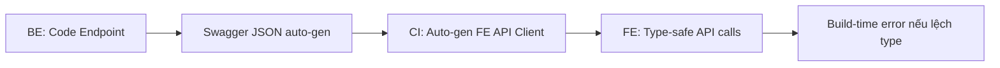
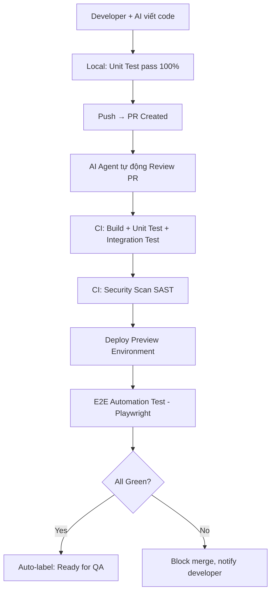

# Bản Đặc Tả Yêu Cầu Framework (AI-First) — v2.1

> **Mục tiêu:** Xây dựng framework nền tảng "AI-First" cho .NET 10+ (BE), React (FE), PostgreSQL (DB).  
> **Đối tượng:** Team 5 người, tận dụng tối đa AI tools (Copilot, Cursor, Antigravity, Claude CLI).  
> **Triết lý:** 90% code do AI sinh ra → framework phải cung cấp đủ **guardrails** (quy tắc ràng buộc) để AI sinh code nhất quán, an toàn, dễ maintain.

---

## 1. Mục tiêu Cốt lõi

- Thiết kế framework tối ưu cho **AI Context** — mỗi module gọn gàng, self-contained, AI tool chỉ cần đọc 1 thư mục là hiểu trọn vẹn 1 tính năng.
- **Giảm thiểu boilerplate**, tăng tối đa code logic nghiệp vụ thực tế.
- Quy trình **rõ ràng minh bạch** giữa BE & FE (Contract-Driven).
- Kết quả **tự động verify** trước khi tới tay Tester/QA.
- Cung cấp **chuẩn mực bắt buộc** (conventions) để mọi AI tool đều sinh code theo cùng một style.

---

## 2. Stack Công nghệ

| Layer          | Công nghệ                | Ghi chú                                      |
| -------------- | ------------------------ | -------------------------------------------- |
| **Backend**    | .NET 10+ (C# 14)        | Minimal APIs hoặc Controllers tùy feature    |
| **Frontend**   | React + TypeScript       | Strict mode, auto-gen API client             |
| **Database**   | PostgreSQL               | ACID, strong consistency mặc định            |
| **Spec/BDD**   | SpecKit                  | BE + FE đều viết spec trước, AI sinh code + test từ spec |
| **Caching**    | Redis (IDistributedCache)| Cache-aside pattern, TTL conventions         |
| **Queue/Jobs** | RabbitMQ hoặc .NET Channels | Background jobs, dead-letter handling     |
| **Auth**       | ASP.NET Identity + JWT Bearer | OAuth2/OIDC cho external providers      |

---

## 3. Kiến trúc Mã Nguồn (Vertical Slice + SpecKit + AI-Optimized)

### 3.1 Feature Module Structure

Mỗi tính năng (feature) gói gọn trong **1 thư mục** duy nhất:

```
Features/
  CreateOrder/
    CreateOrderCommand.cs       # Request DTO + Handler
    CreateOrderValidator.cs     # FluentValidation rules
    CreateOrderResponse.cs      # Response DTO
    CreateOrderEndpoint.cs      # API endpoint mapping
    CreateOrderSpec.md          # SpecKit specification
    CreateOrderTests.cs         # Unit/Integration test
```

### 3.2 Module Conventions (AI Rules)

> **Tại sao:** Khi nhiều người dùng nhiều AI tool khác nhau, cần conventions cứng để đảm bảo output nhất quán.

- **Max 200 dòng/file** — nếu vượt, tách thành sub-modules.
- **Naming:** `{Feature}{Action}{Type}.cs` (vd: `CreateOrderCommand.cs`).
- **Mỗi feature phải có:** Endpoint, Command/Query, Validator, Response DTO, ít nhất 1 test.
- **Không reference chéo giữa feature folders** — dùng shared contracts/abstractions thay vì reference trực tiếp.

### 3.3 Shared Infrastructure Layer

```
Infrastructure/
  Auth/               # Authentication & Authorization middleware
  Persistence/        # DbContext, base repository, migration config
  Caching/            # Redis wrapper, cache key conventions
  Resilience/         # HTTP resilience policies (Polly)
  Logging/            # Serilog configuration, log enrichment
  Validation/         # FluentValidation pipeline behavior
  ErrorHandling/      # Global exception handler, Result<T> pattern
```

---

## 4. Error Handling (Framework-Level)

### 4.1 Result Pattern

Mọi business logic trả về `Result<T>` thay vì throw exception:

```csharp
public sealed record Result<T>(T? Value, Error? Error, bool IsSuccess);
public sealed record Error(string Code, string Message, ErrorType Type);
public enum ErrorType { Validation, NotFound, Conflict, Forbidden, Internal }
```

### 4.2 Global Exception Middleware

- Catch unhandled exceptions → log + trả `ProblemDetails` (RFC 7807).
- **Không bao giờ** leak stack trace ra client.
- Error response format chuẩn:

```json
{
  "type": "https://errors.arcticfactory.dev/validation",
  "title": "Validation Error",
  "status": 400,
  "errors": { "Name": ["Name is required"] }
}
```

### 4.3 AI Rule

> Khi AI sinh code: **Luôn dùng `Result<T>`, không throw business exception.** Exception chỉ dành cho lỗi hệ thống (DB connection lost, timeout).

---

## 5. Quy trình BE & FE (Contract-Driven)

### 5.1 API-First Workflow



- BE **bắt buộc** cung cấp OpenAPI/Swagger schema.
- FE **cấm** gọi Fetch thủ công hoặc tự định nghĩa Type — phải dùng tool auto-gen (NSwag / OpenAPI Generator / RTK Query codegen).
- Sai type = Build FE vỡ → phát hiện ngay, không để lọt tới runtime.

### 5.2 API Versioning

- URL-path based: `/api/v1/orders`, `/api/v2/orders`.
- Backward compatible: version cũ tồn tại ít nhất **1 release cycle** sau khi version mới ra.
- Breaking change: buộc phải ghi rõ trong PR description + migration guide.

### 5.3 Response Conventions

- List endpoints: **bắt buộc pagination** (cursor-based hoặc offset).
- Payload: chỉ trả fields cần thiết (sparse fieldsets nếu có).
- Compression: gzip/Brotli enabled mặc định.

---

## 6. Security Architecture

### 6.1 Authentication

- **Mặc định:** ASP.NET Identity + JWT Bearer tokens.
- Access token: short-lived (15-30 phút), Refresh token: rotation.
- Hỗ trợ OAuth2/OIDC cho external providers (Google, Microsoft).

### 6.2 Authorization

- **Policy-based** (`[Authorize(Policy = "CanManageOrders")]`).
- RBAC (Role-Based Access Control) cho admin/user/viewer.
- Resource-level authorization: kiểm tra quyền sở hữu tài nguyên.
- Enforce ở **cả middleware và service layer**, không chỉ controller.

### 6.3 Input Validation (Bắt buộc)

- **FluentValidation** cho mọi Command/Query.
- Auto-validation via **MediatR Pipeline Behavior** — không cần gọi tay.
- Server-side validation **luôn luôn**, không tin client.
- Parameterized queries (EF Core) — **tuyệt đối không string concatenation SQL**.

### 6.4 Secret Management

- Dev: .NET User Secrets (`dotnet user-secrets`).
- Container: Environment variables (Docker/K8s secrets).
- Production: Vault integration (HashiCorp Vault / Azure Key Vault).
- **AI Rule:** AI-generated code **không bao giờ** chứa hardcoded secret. Pre-commit hook quét và chặn.

### 6.5 Security Headers & CORS

- CORS: chỉ cho phép origin cụ thể (không dùng `*` cho authenticated endpoints).
- Headers bắt buộc: `HSTS`, `X-Content-Type-Options: nosniff`, `X-Frame-Options: DENY`, `CSP`.
- TLS 1.2+ bắt buộc cho mọi external communication.

---

## 7. Data Architecture (PostgreSQL)

### 7.1 Schema Conventions

- Naming: **snake_case** cho tables và columns (PostgreSQL convention).
- Constraints: `NOT NULL`, `UNIQUE`, `FOREIGN KEY`, `CHECK` enforce ở DB level.
- Normalization: 3NF cho OLTP. Denormalize có chủ đích và phải document.
- Soft delete pattern: `is_deleted` + `deleted_at` thay vì xóa cứng.

### 7.2 Migration Strategy

- Tool: **EF Core Migrations** (code-first).
- Policy: **Forward-only** — không viết down migration cho production.
- CI: Migration test tự động trong pipeline.
- Rule: **Không lock table** trong migration (no `ALTER TABLE ... ADD COLUMN NOT NULL` without default).

### 7.3 Connection Management

- **Npgsql + Connection Pooling** (mặc định trong EF Core).
- Pool size: `MaxPoolSize = 20` per instance (tuning theo load).
- Connection lifetime: `ConnectionLifetime = 300s`.
- Dự phòng: PgBouncer khi scale > 5 instances.

### 7.4 Backup & Recovery

- Automated daily backup (pg_dump hoặc WAL archiving).
- PITR (Point-In-Time Recovery) via PostgreSQL WAL.
- **RPO:** < 1 giờ. **RTO:** < 4 giờ.
- Monthly restore test để verify backup integrity.

---

## 8. Performance Guidelines

### 8.1 Targets

- **P99 API response:** < 500ms cho endpoints thông thường.
- **P99 API response:** < 2s cho endpoints có report/aggregation.
- **Throughput:** Hỗ trợ 1K concurrent users (target hiện tại).

### 8.2 AI Rules cho Performance

- **Bắt buộc pagination** cho mọi list endpoint (`LIMIT` + cursor/offset).
- **Không N+1:** Dùng `.Include()` hoặc explicit join. EF Core query split nếu cần.
- **Projection only:** Dùng `.Select()` cho read-only queries, không load full entity.
- **Async/await:** Mọi I/O operation phải async (DB, HTTP, file).

### 8.3 Caching Strategy

- **Pattern:** Cache-aside (check cache → miss → query DB → set cache).
- **Provider:** Redis (`IDistributedCache`).
- **TTL mặc định:** 5 phút cho data thường, 30 phút cho reference data, 0 (no cache) cho real-time data.
- **Invalidation:** Event-driven — khi write xảy ra, invalidate cache key liên quan.

### 8.4 Async Processing

- Long-running tasks (> 3s): đẩy vào **background job** (Hangfire hoặc .NET BackgroundService).
- Dead-letter queue cho failed jobs.
- Idempotent processing: mọi job handler phải hỗ trợ retry an toàn.

---

## 9. Resilience & Fault Tolerance

- **HTTP Resilience:** Polly policies (retry with exponential backoff + jitter, circuit breaker, timeout).
- **Timeout budget:** Mỗi external call có explicit timeout (mặc định 10s).
- **Circuit breaker:** Open sau 5 failures liên tiếp, half-open sau 30s.
- **Graceful degradation:** Khi dependency down, trả cached data hoặc degraded response thay vì 500.

---

## 10. Observability & Monitoring

### 10.1 Logging

- **Serilog** với structured logging (JSON format).
- Log levels đúng: `Debug` (dev), `Info` (business events), `Warning` (anomaly), `Error` (failures).
- **Tuyệt đối không** log sensitive data (password, token, PII).
- Correlation ID propagation qua mọi request.
- **Log aggregation:** Đẩy log vào **Loki** qua Serilog Sink.

### 10.2 Monitoring Stack (Loki + Prometheus + Grafana)

Toàn bộ monitoring stack chạy bằng **Docker Compose** cả ở local dev lẫn on-prem:

```yaml
# docker-compose.monitoring.yml (minh họa)
services:
  prometheus:
    image: prom/prometheus:latest
    ports: ["9090:9090"]
    volumes:
      - ./monitoring/prometheus.yml:/etc/prometheus/prometheus.yml

  loki:
    image: grafana/loki:latest
    ports: ["3100:3100"]
    volumes:
      - ./monitoring/loki-config.yml:/etc/loki/local-config.yaml

  grafana:
    image: grafana/grafana:latest
    ports: ["3000:3000"]
    environment:
      - GF_SECURITY_ADMIN_PASSWORD=admin
    volumes:
      - ./monitoring/grafana/provisioning:/etc/grafana/provisioning
```

| Thành phần     | Vai trò                                              | Truy cập local       |
| -------------- | ---------------------------------------------------- | -------------------- |
| **Prometheus** | Thu thập metrics từ BE (.NET) qua `/metrics` endpoint | `http://localhost:9090` |
| **Loki**       | Nhận và lưu trữ logs từ Serilog                       | `http://localhost:3100` |
| **Grafana**    | Dashboard trực quan: logs, metrics, alerts             | `http://localhost:3000` |

- **BE .NET** expose metrics endpoint `/metrics` qua `prometheus-net` hoặc OpenTelemetry Exporter.
- **Serilog → Loki:** Dùng `Serilog.Sinks.Grafana.Loki` sink để đẩy structured logs.
- **Grafana Dashboards:** Pre-configured dashboards commit trong repo (`/monitoring/grafana/provisioning/`).

### 10.3 Metrics & Tracing

- **OpenTelemetry** cho distributed tracing.
- RED metrics: Rate (requests/sec), Errors (error rate %), Duration (latency).
- Prometheus scrape .NET `/metrics` endpoint mỗi 15s.
- Traces visualize trong Grafana (qua Tempo hoặc Jaeger nếu cần nâng cao).

### 10.4 Health Checks

- `/health` endpoint cho liveness probe.
- `/ready` endpoint cho readiness probe (check DB connection, Redis, Loki, etc.).

### 10.5 Alerting

- Alert rules cấu hình trong Grafana (hoặc Prometheus Alertmanager).
- Kênh thông báo: Telegram bot / Email / Slack webhook.
- Các alert tối thiểu:
  - API error rate > 5% trong 5 phút.
  - P99 latency > 2s trong 3 phút.
  - Container restart count > 2 trong 10 phút.
  - Disk usage > 80%.

---

## 11. AI Collaboration & Governance

> **Mục đích:** Khi 5 người cùng dùng AI tools khác nhau, cần quy tắc phối hợp để code không phân mảnh.

### 11.1 AI Rules File

Mỗi project có file `.ai-rules.md` ở root, chứa:
- Coding conventions (naming, structure, patterns).
- Forbidden patterns (no throw exception cho business logic, no manual fetch, no hardcoded secrets).
- Preferred patterns (Result pattern, FluentValidation, async/await).
- Ví dụ code mẫu cho từng pattern.

### 11.2 Code Ownership & Review

- AI-generated code **phải được review bởi con người** trước khi merge.
- PR description **bắt buộc ghi rõ:** phần nào do AI sinh, phần nào viết tay.
- Reviewer chịu trách nhiệm cho code đã approve, bất kể nguồn gốc (AI hay human).

### 11.3 Conflict Resolution

- **Feature scope locking:** Mỗi người chỉ làm 1 feature tại 1 thời điểm. Không 2 người cùng AI vào 1 feature folder.
- **Branch strategy:** Feature branch per ticket → PR → merge to `develop`.
- **Merge conflict:** Người merge chịu trách nhiệm resolve. AI không tự merge.

### 11.4 AI Tool Configuration

Mỗi AI tool (Copilot, Cursor, Antigravity) load cùng 1 bộ rules từ file `.ai-rules.md` và các docs trong thư mục `/docs/conventions/`. Điều này đảm bảo output nhất quán dù dùng tool nào.

---

## 12. Verification Pipeline (CI/CD)



### 12.1 Pipeline Stages

1. **Local Dev:** AI sinh code theo SpecKit → chạy unit test local.
2. **PR Review:** AI Agent (Antigravity / Copilot) review code — kiểm tra logic, security, style, test coverage.
3. **CI Pipeline:** Build → Unit Test → Integration Test → SAST scan (Semgrep/CodeQL).
4. **Preview Deploy:** Deploy lên preview environment (container).
5. **E2E Test:** Playwright chạy kịch bản front-to-back trên preview env.
6. **Quality Gate:** 100% pass → tự động gán label "Ready for QA" trên ticket. Tester chỉ test logic nghiệp vụ.

### 12.2 Pipeline SLA

- **Target:** Pipeline hoàn thành < 15 phút.
- Các stage chạy song song khi có thể (BE test + FE test parallel).

---

## 13. Deployment & Environment Strategy

### 13.1 Environments

| Environment | Mục đích           | Trigger                    |
| ----------- | ------------------- | -------------------------- |
| Local       | Dev + AI coding     | `dotnet run` / `npm dev`   |
| Preview     | Per-PR validation   | Auto-deploy từ PR pipeline |
| Staging     | Pre-production test | Merge to `develop`         |
| Production  | Live                | Tag release + approval     |

### 13.2 Deployment Strategy

- **Rolling deployment** mặc định (zero-downtime).
- **Rollback:** Tự động rollback nếu health check fail trong 2 phút sau deploy.
- **DB Migration:** Chạy trước deployment, backward-compatible, không lock.

### 13.3 Container Strategy

- Docker multi-stage build (build → runtime image).
- Target: on-prem container → Kubernetes (K8s) → AWS ECS/EKS.
- Base image: `.NET Aspire` hoặc `mcr.microsoft.com/dotnet/aspnet` (official, pinned version).

---

## 14. Capacity Planning

| Metric            | Hiện tại     | 6 tháng      | 12 tháng       |
| ----------------- | ------------ | ------------ | -------------- |
| Concurrent users  | 1,000        | 3,000        | 10,000         |
| API requests/sec  | 100          | 300          | 1,000          |
| DB size           | < 10 GB      | < 50 GB      | < 200 GB       |
| Instances (BE)    | 2            | 3-5          | 5-10 (K8s HPA) |

**Breaking point hiện tại:** Single PostgreSQL instance có thể handle tới ~5K concurrent connections. Khi vượt 3K users, cân nhắc thêm read replica + PgBouncer.

---

## 15. Quy trình Developer: Ví dụ Thực tế

> Phần này mô tả chi tiết quy trình **con người + AI** phối hợp khi tạo mới, sửa, xóa một tính năng (feature).

### 15.1 Tạo mới một màn hình (Ví dụ: "Quản lý Đơn hàng")

#### Bước 1 — BE Developer (Human) viết Spec

```markdown
<!-- Features/ListOrders/ListOrdersSpec.md -->
# Spec: Danh sách Đơn hàng

## Mô tả
Lấy danh sách đơn hàng theo bộ lọc, phân trang.

## Input
- `status`: enum (Pending, Confirmed, Shipped, Cancelled) — optional
- `page`: int — mặc định 1
- `pageSize`: int — mặc định 20, max 100

## Output
- Danh sách: `id`, `customerName`, `totalAmount`, `status`, `createdAt`
- Metadata: `totalCount`, `currentPage`, `totalPages`

## Business Rules
- Chỉ user có role `Admin` hoặc `OrderManager` mới được truy cập.
- Sắp xếp mặc định theo `createdAt` giảm dần.
```

#### Bước 2 — AI sinh code từ Spec

Developer mở AI tool (Copilot/Cursor/Antigravity), trỏ vào file Spec và yêu cầu:
> "Tạo feature ListOrders theo spec này, tuân thủ conventions trong `.ai-rules.md`."

AI sẽ sinh ra toàn bộ files trong folder `Features/ListOrders/`:
- `ListOrdersQuery.cs` — Request DTO + Handler
- `ListOrdersValidator.cs` — FluentValidation
- `ListOrdersResponse.cs` — Response DTO
- `ListOrdersEndpoint.cs` — Minimal API endpoint
- `ListOrdersTests.cs` — Unit tests

#### Bước 3 — Human review code AI sinh

Developer kiểm tra:
- [ ] Logic đúng theo Spec?
- [ ] Có tuân thủ Result pattern không?
- [ ] Có pagination không?
- [ ] Có authorization attribute `[Authorize(Policy = "...")]` không?
- [ ] Validator có đủ rules không?
- [ ] Test cases có cover happy path + edge cases không?

#### Bước 4 — FE Developer (Human) viết FE Spec + nhận API

Sau khi BE merge → CI tự sinh Swagger → FE chạy codegen:
```bash
npm run generate-api   # Auto-gen TypeScript client từ Swagger
```

FE Developer **viết FE Spec (SpecKit)** trước khi yêu cầu AI tạo component:

```markdown
<!-- src/features/ListOrders/ListOrdersSpec.md -->
# FE Spec: Trang Danh sách Đơn hàng

## Layout
- Header: Tiêu đề + nút "Tạo đơn hàng mới"
- Filter bar: Dropdown trạng thái (đơn hàng), Date range picker
- Bảng dữ liệu: các cột id, customerName, totalAmount, status, createdAt
- Phân trang: Previous / Next + số trang hiện tại

## Data Mapping
- API: `orderApi.listOrders({ status, page, pageSize })`
- Response mapping: items → table rows, totalCount → pagination

## UX Flow
- Loading: Skeleton loader cho bảng
- Empty: "Chưa có đơn hàng nào" + icon
- Error: Toast thông báo + nút Retry
- Filter thay đổi: reset về trang 1
```

Sau đó FE Developer dùng AI để sinh React component:
> "Tạo trang danh sách đơn hàng theo FE Spec tại `src/features/ListOrders/ListOrdersSpec.md`, dùng API client `orderApi.listOrders()`. Tuân thủ `.ai-rules.md`."

#### Bước 5 — Verify trước Tester

- Pipeline CI/CD chạy tự động (unit test + E2E test).
- Tất cả xanh → ticket tự động chuyển "Ready for QA".

---

### 15.2 Sửa một tính năng (Ví dụ: "Thêm filter theo ngày")

#### Quy trình

1. **Human cập nhật Spec** — thêm field `fromDate`, `toDate` vào `ListOrdersSpec.md`.
2. **AI đọc diff Spec** — developer yêu cầu AI:
   > "Spec đã thay đổi, cập nhật Query, Validator, Response, Test cho phù hợp."
3. **AI sinh code diff** — chỉ sửa đúng phần liên quan, không tạo lại từ đầu.
4. **Human review diff** — kiểm tra:
   - [ ] Backward compatible? (FE cũ vẫn chạy nếu không truyền `fromDate`).
   - [ ] Migration DB (nếu cần thêm index)?
   - [ ] Test cũ vẫn pass + test mới cho filter mới?
5. **FE cập nhật** — chạy lại `npm run generate-api` → TypeScript types tự động có `fromDate`, `toDate`. Cập nhật FE Spec nếu UI bị ảnh hưởng.
6. **Pipeline verify** → lên QA.

---

### 15.3 Xóa một tính năng (Ví dụ: "Loại bỏ trang báo cáo cũ")

#### Quy trình

1. **Human quyết định xóa** — tạo ticket, ghi rõ lý do và impact analysis.
2. **Kiểm tra dependency:**
   - Có feature nào khác reference tới feature này không?
   - Có FE component nào gọi API này không?
   - Có migration hoặc data nào cần clean up không?
3. **Xóa code:**
   - Xóa toàn bộ feature folder (VD: `Features/LegacyReport/`).
   - Xóa route registration trong Endpoint mapping.
   - Xóa FE component và route tương ứng.
4. **AI hỗ trợ:** Yêu cầu AI quét toàn bộ codebase tìm references còn sót:
   > "Tìm mọi reference tới `LegacyReport` trong toàn bộ dự án và liệt kê."
5. **Chạy full test suite** — đảm bảo không feature nào bị vỡ.
6. **Cập nhật tài liệu** — xóa/cập nhật Spec liên quan.

---

### 15.4 Quy trình Maintain Tài liệu

#### Nguyên tắc: "Spec là Source of Truth"

| Loại tài liệu      | Vị trí                              | Ai cập nhật          | Khi nào cập nhật               |
| ------------------- | ----------------------------------- | -------------------- | ------------------------------ |
| **Feature Spec (BE)** | `Features/{Name}/{Name}Spec.md`     | BE Dev (bắt buộc)     | Mỗi khi thay đổi nghiệp vụ    |
| **Feature Spec (FE)** | `src/features/{Name}/{Name}Spec.md` | FE Dev (bắt buộc)     | Mỗi khi thay đổi UI/UX       |
| **API Docs**        | Auto-gen từ Swagger                 | Tự động (CI)         | Mỗi lần build                  |
| **AI Rules**        | `.ai-rules.md` ở root              | Tech Lead            | Khi thêm/sửa conventions       |
| **Architecture**    | `docs/architecture/`                | Human                | Khi thay đổi kiến trúc lớn     |
| **Changelog**       | `CHANGELOG.md`                      | Human hoặc AI (từ PR)| Mỗi release                    |
| **Runbook/Ops**     | `docs/runbooks/`                    | Human                | Khi thêm service/infra mới     |

#### Quy tắc duy trì

- **Spec phải cập nhật TRƯỚC code** — không có chuyện code xong mới viết spec.
- **PR không được merge nếu Spec lỗi thời** — reviewer phải check Spec trong PR review.
- **AI hỗ trợ phát hiện tài liệu cũ:** Định kỳ (mỗi sprint), chạy AI quét Spec vs Code để phát hiện drift:
  > "So sánh nội dung Spec với code thực tế trong feature folder, báo cáo sai lệch."
- **Swagger là tài liệu API duy nhất** — không maintain tài liệu API bằng tay ở nơi khác.

---

## 16. AI Prompt Templates Library

> **Mục đích:** Chuẩn hóa cách developer "ra lệnh" cho AI tools. Dùng prompt mẫu đảm bảo output nhất quán, dù dùng Copilot, Cursor, Antigravity hay Claude CLI.
>
> **Cách dùng:** Copy prompt mẫu → thay `{placeholder}` → paste vào AI tool.

### 16.1 Tạo mới Feature (BE)

```
Tạo feature "{TênFeature}" theo SpecKit specification trong file:
  {đường_dẫn_tới_Spec.md}

Yêu cầu bắt buộc:
1. Tuân thủ conventions trong `.ai-rules.md`
2. Tạo đầy đủ files trong folder Features/{TênFeature}/:
   - {TênFeature}Command.cs hoặc {TênFeature}Query.cs (Request DTO + Handler)
   - {TênFeature}Validator.cs (FluentValidation)
   - {TênFeature}Response.cs (Response DTO)
   - {TênFeature}Endpoint.cs (Minimal API endpoint)
   - {TênFeature}Tests.cs (Unit tests)
3. Dùng Result<T> pattern, KHÔNG throw business exception
4. Bắt buộc có [Authorize(Policy = "...")] nếu Spec yêu cầu phân quyền
5. List endpoint phải có pagination
6. Async/await cho mọi I/O
7. Max 200 dòng/file
```

### 16.2 Viết Unit Test

```
Viết unit tests cho feature "{TênFeature}" tại:
  {đường_dẫn_tới_Handler.cs}

Yêu cầu:
1. Naming: Should_{KếtQuả}_When_{ĐiềuKiện}
2. Pattern: Arrange-Act-Assert rõ ràng
3. Cases tối thiểu:
   - Happy path (input hợp lệ → kết quả đúng)
   - Validation fail (input thiếu/sai → trả lỗi validation)
   - Not found (resource không tồn tại → trả lỗi not found)
   - Unauthorized (user không có quyền → trả lỗi forbidden)
   - Edge case: empty list, giá trị biên min/max, null/trống
4. Mock dependencies bằng NSubstitute hoặc Moq
5. KHÔNG gọi DB thật trong unit test
```

### 16.3 Review Code (AI-Assisted)

```
Review code trong PR này theo checklist:

1. **Logic:** Code có đúng theo Spec không?
   Spec tại: {đường_dẫn_tới_Spec.md}

2. **Security:**
   - Có input validation (FluentValidation) không?
   - Có authorization attribute không?
   - Có hardcoded secret nào không?
   - Có SQL injection risk (string concatenation) không?

3. **Performance:**
   - Có N+1 query không? (thiếu .Include() hoặc .Select())
   - List endpoint có pagination không?
   - I/O operations có async/await không?

4. **Conventions:**
   - Dùng Result<T> thay vì throw exception?
   - Naming đúng convention {Feature}{Action}{Type}?
   - File < 200 dòng?
   - Không reference chéo giữa feature folders?

5. **Test:**
   - Có test cho happy path + edge cases không?
   - Test naming: Should_{X}_When_{Y}?

Trả kết quả dạng:
✅ Đạt / ⚠️ Cần sửa / ❌ Không đạt — kèm giải thích ngắn.
```

### 16.4 Sửa Feature (theo diff Spec)

```
Spec của feature "{TênFeature}" đã thay đổi.

Spec cũ vs mới (diff):
  {mô_tả_thay_đổi_hoặc_link_diff}

Yêu cầu:
1. Cập nhật CHỈ phần liên quan, KHÔNG tạo lại từ đầu
2. Đảm bảo backward compatible (field mới là optional)
3. Cập nhật Validator cho field mới
4. Cập nhật Response DTO nếu output thay đổi
5. Thêm test case mới cho thay đổi
6. Giữ nguyên test cũ (phải vẫn pass)
7. Nếu cần migration DB, tạo migration riêng (forward-only, không lock table)
```

### 16.5 Xóa Feature

```
Xóa feature "{TênFeature}" khỏi dự án.

Thực hiện:
1. Quét toàn bộ codebase tìm mọi reference tới "{TênFeature}"
2. Liệt kê danh sách files/components bị ảnh hưởng
3. Xóa feature folder: Features/{TênFeature}/
4. Xóa endpoint registration
5. Xóa FE component và route liên quan (nếu có)
6. Kiểm tra shared services — nếu không ai dùng nữa thì xóa
7. KHÔNG xóa migration files (giữ history)
8. Báo cáo: files đã xóa, references đã clean, files cần review thủ công
```

### 16.6 Tạo DB Migration

```
Tạo EF Core migration cho thay đổi:
  {mô_tả_thay_đổi_schema}

Quy tắc:
1. Forward-only — KHÔNG viết Down() method
2. KHÔNG dùng ALTER TABLE ... ADD COLUMN NOT NULL mà không có DEFAULT
3. KHÔNG lock table (tránh ALTER TABLE ... ADD COLUMN trên bảng lớn nếu có risk)
4. Naming: {Timestamp}_{MôTảNgắn}.cs (VD: 20260327_AddOrderStatusIndex)
5. Nếu thêm index: dùng CREATE INDEX CONCURRENTLY (nếu PostgreSQL hỗ trợ)
6. Test: migration chạy được trên DB trống + DB có data
```

### 16.7 Tạo FE Component (React)

```
Tạo React component cho feature "{TênFeature}".

FE Spec (SpecKit) tại: {dưong_dấn_tới_FE_Spec.md}
API Client đã auto-gen tại: {đường_dẫn_api_client}
API method: {tên_method} (VD: orderApi.listOrders())

Yêu cầu:
1. Tuân thủ FE Spec về layout, data mapping, UX flow
2. Tuân thủ conventions trong `.ai-rules.md`
3. TypeScript strict — KHÔNG dùng `any`
4. Dùng API client auto-gen, KHÔNG fetch thủ công
5. Có loading state, error handling, empty state (theo FE Spec)
6. List: có pagination component
7. Form: có client-side validation (mirror server rules)
8. Responsive: mobile-first
9. Tách component nhỏ, single responsibility
10. Đặt trong folder: src/features/{TênFeature}/
```

---

## 17. Danh sách Artifacts trong Quy trình Phát triển

> **Mục đích:** Định nghĩa rõ ràng mỗi bước trong quy trình phát triển một Feature **nhận INPUT gì** và **tạo ra OUTPUT gì**. Mọi thành viên (BA, BE, FE, AI) đều biết chính xác file nào cần đọc, file nào cần tạo, và **ai chịu trách nhiệm** nếu output sai.

### 17.1 Tổng quan Luồng Artifacts

```
┌──────────────────────────────────────────────────────────────────────────┐
│                        LUỒNG PHÁT TRIỂN (Flow)                          │
│                                                                          │
│  ❶ BA viết BRD ──► ❷ Ticket/PRD                                        │
│                        │                                                 │
│              ┌─────────┴──────────┐                                      │
│              ▼                    ▼                                       │
│     ❸ BE Spec (.md)        ❻ FE Spec (.md)                              │
│           │                      │                                       │
│           ▼                      ▼                                       │
│     ❹ BE Code (.cs)        ❽ FE Code (React)                            │
│           │                      ▲                                       │
│           ▼                      │                                       │
│     ❺ Swagger JSON ──► ❼ TS API Client ─────┘                           │
│                                                                          │
│  Tài liệu xuyên suốt: .ai-rules.md, CHANGELOG, Runbook                 │
└──────────────────────────────────────────────────────────────────────────┘
```

---

### 17.2 Chi tiết từng Artifact

#### 📄 Artifact 0: BRD — Business Requirements Document (BA viết)

| Thuộc tính | Giá trị |
|------------|---------|
| **Ai tạo** | BA (Business Analyst) — bắt buộc |
| **Ai đọc** | PO (duyệt), Tech Lead, BE Dev, FE Dev |
| **Input** | Yêu cầu từ stakeholders / khách hàng / PO |
| **Output** | File `.md` chuẩn BRD |
| **Định dạng** | Markdown |
| **Vị trí lưu** | `docs/brd/BRD-{mã}.md` |

> ⚠️ **BRD là nguồn chân lý gốc (Single Source of Truth)** — Mọi Spec (BE/FE) đều phải truy ngược về BRD này. Nếu không có BRD thì không được phép bắt đầu phát triển.

**Ví dụ mẫu:**

```markdown
<!-- docs/brd/BRD-042-QuanLyDonHang.md -->
# BRD-042: Quản lý Đơn hàng

## 1. Bối cảnh và Mục tiêu
Hệ thống hiện tại chưa có chức năng quản lý đơn hàng tập trung.
Mục tiêu: Cung cấp giao diện cho Admin/OrderManager để xem, lọc,
theo dõi trạng thái đơn hàng.

## 2. Đối tượng sử dụng
- Admin: xem tất cả đơn hàng, thay đổi trạng thái
- OrderManager: xem đơn thuộc khu vực mình quản lý
- Customer: KHÔNG truy cập (phạm vi khác)

## 3. User Stories
- US-1: Admin muốn xem danh sách đơn hàng, lọc theo trạng thái, phân trang.
- US-2: Admin muốn xem chi tiết 1 đơn hàng.
- US-3: Admin muốn cập nhật trạng thái đơn hàng.

## 4. Acceptance Criteria (AC)
| AC#  | Mô tả                                                     | Ưu tiên |
|------|------------------------------------------------------------|----------|
| AC-1 | Bảng hiển thị: id, tên khách, tổng tiền, trạng thái, ngày | P0       |
| AC-2 | Lọc theo trạng thái: Pending/Confirmed/Shipped/Cancelled  | P0       |
| AC-3 | Phân trang: 20 dòng/trang, Previous/Next                  | P0       |
| AC-4 | Chỉ Admin và OrderManager truy cập                        | P0       |
| AC-5 | Xem chi tiết đơn hàng khi click vào 1 dòng               | P1       |
| AC-6 | Thay đổi trạng thái đơn (Confirm/Ship/Cancel)             | P1       |

## 5. Phạm vi phát triển
- Giai đoạn 1 (Sprint 5): US-1 — AC-1, AC-2, AC-3, AC-4
- Giai đoạn 2 (Sprint 6): US-2, US-3 — AC-5, AC-6

## 6. Wireframe / Mockup
- [Link Figma: Trang Đơn hàng](https://figma.com/...)
- Ảnh tham khảo: xem `docs/brd/assets/BRD-042-mockup.png`

## 7. Ghi chú nghiệp vụ
- Đơn hàng đã Cancelled không được chuyển lại Confirmed.
- Sắp xếp mặc định theo ngày tạo giảm dần.
- PageSize tối đa 100 dòng (tránh quá tải server).
```

---

#### 📄 Artifact 1: Ticket / PRD (Product Requirement Document)

| Thuộc tính | Giá trị |
|------------|---------|
| **Ai tạo** | PO / Tech Lead (dựa trên BRD từ BA) |
| **Ai đọc** | BE Developer, FE Developer |
| **Input** | BRD từ BA + ưu tiên từ PO |
| **Output** | Jira ticket / Linear issue / Markdown |
| **Vị trí lưu** | Project management tool (Jira/Linear) hoặc `docs/prd/` |
| **Liên kết** | Phải reference BRD gốc: `Ref: BRD-042` |

> **Ticket/PRD chỉ là phiên bản kỹ thuật hoá của BRD** — tách nhỏ User Stories thành các task cụ thể cho dev. Không được thêm/bớt yêu cầu so với BRD mà không có approval từ BA.

**Ví dụ mẫu:**

```markdown
<!-- docs/prd/PRD-042-ListOrders.md -->
# PRD-042-A: Danh sách Đơn hàng (Giai đoạn 1)

Ref: BRD-042 | Sprint: 5 | Priority: P0

## Scope
Triển khai US-1 theo BRD-042: Xem danh sách đơn hàng + Lọc + Phân trang.

## Acceptance Criteria (kế thừa từ BRD)
- AC-1: Bảng hiển thị: id, tên khách, tổng tiền, trạng thái, ngày tạo
- AC-2: Lọc theo trạng thái: Pending/Confirmed/Shipped/Cancelled
- AC-3: Phân trang: 20 dòng/trang, Previous/Next
- AC-4: Chỉ Admin và OrderManager truy cập

## Task Breakdown
- BE: Tạo API GET /api/v1/orders (filter + pagination)
- FE: Tạo trang Danh sách đơn hàng (table + filter + pagination)

## Definition of Done
- [ ] BE API hoạt động đúng AC
- [ ] FE UI match wireframe trong BRD
- [ ] Unit test + E2E test pass
- [ ] Code review approved
```

---

#### 📄 Artifact 2: BE Spec (SpecKit — Backend)

| Thuộc tính | Giá trị |
|------------|---------|
| **Ai tạo** | BE Developer (Human — bắt buộc) |
| **Ai đọc** | AI Assistant (để sinh code BE), FE Developer (để hiểu logic) |
| **Input** | **BRD từ BA** + Ticket/PRD + `.ai-rules.md` |
| **Output** | File `.md` chuẩn SpecKit |
| **Vị trí lưu** | `Features/{TênFeature}/{TênFeature}Spec.md` |
| **Liên kết** | Phải reference BRD + AC gốc: `Ref: BRD-042, AC-1,2,3,4` |

**Ví dụ mẫu:**

```markdown
<!-- Features/ListOrders/ListOrdersSpec.md -->
# Spec: Danh sách Đơn hàng

## Mô tả
Lấy danh sách đơn hàng theo bộ lọc, phân trang.

## HTTP
- Method: GET
- Route: /api/v1/orders
- Auth: Required — Policy "CanViewOrders"

## Input (Query Parameters)
| Param      | Type   | Required | Default | Constraint         |
|------------|--------|----------|---------|--------------------|
| status     | enum   | No       | null    | Pending/Confirmed/Shipped/Cancelled |
| page       | int    | No       | 1       | >= 1               |
| pageSize   | int    | No       | 20      | 1..100             |

## Output (200 OK)
```json
{
  "items": [
    {
      "id": "uuid",
      "customerName": "string",
      "totalAmount": 150000,
      "status": "Pending",
      "createdAt": "2026-03-27T10:00:00Z"
    }
  ],
  "totalCount": 142,
  "currentPage": 1,
  "totalPages": 8
}
```

## Business Rules
1. Chỉ user có role Admin hoặc OrderManager mới truy cập
2. Sắp xếp mặc định theo createdAt giảm dần
3. pageSize max = 100 (chặn ở Validator)

## Error Cases
| Scenario               | HTTP Code | Error Code         |
|------------------------|-----------|--------------------|
| Không có quyền         | 403       | ORDER.FORBIDDEN    |
| pageSize > 100         | 400       | VALIDATION.INVALID |
```

---

#### 📄 Artifact 3: BE Code (AI-generated)

| Thuộc tính | Giá trị |
|------------|---------|
| **Ai tạo** | AI Assistant (sinh từ BE Spec) |
| **Ai review** | BE Developer (Human — bắt buộc) |
| **Input** | BE Spec (.md) + `.ai-rules.md` |
| **Output** | Folder code hoàn chỉnh |
| **Vị trí lưu** | `Features/{TênFeature}/` |

**Output files sinh ra:**

```
Features/ListOrders/
├── ListOrdersSpec.md           ← (đã có — Human viết)
├── ListOrdersQuery.cs          ← Request DTO + MediatR Handler
├── ListOrdersValidator.cs      ← FluentValidation rules
├── ListOrdersResponse.cs       ← Response DTO
├── ListOrdersEndpoint.cs       ← Minimal API route mapping
└── ListOrdersTests.cs          ← Unit tests (xUnit + NSubstitute)
```

---

#### 📄 Artifact 4: Swagger JSON (Auto-generated — Cầu nối BE → FE)

| Thuộc tính | Giá trị |
|------------|---------|
| **Ai tạo** | CI Pipeline (tự động từ BE code) |
| **Ai đọc** | CodeGen tool → FE Developer |
| **Input** | BE Code đã build thành công |
| **Output** | File `swagger.json` |
| **Vị trí lưu** | `artifacts/swagger.json` hoặc endpoint `/swagger/v1/swagger.json` |

> ⚠️ **Đây là file "cầu nối" quan trọng nhất.** FE không bao giờ đọc BE code trực tiếp — FE chỉ đọc Swagger JSON.

**Ví dụ mẫu (trích đoạn):**

```json
{
  "openapi": "3.0.1",
  "info": { "title": "ArcticFactory API", "version": "v1" },
  "paths": {
    "/api/v1/orders": {
      "get": {
        "operationId": "ListOrders",
        "parameters": [
          { "name": "status", "in": "query", "schema": { "type": "string", "enum": ["Pending","Confirmed","Shipped","Cancelled"] }},
          { "name": "page", "in": "query", "schema": { "type": "integer", "default": 1 }},
          { "name": "pageSize", "in": "query", "schema": { "type": "integer", "default": 20 }}
        ],
        "responses": {
          "200": {
            "content": {
              "application/json": {
                "schema": { "$ref": "#/components/schemas/ListOrdersResponse" }
              }
            }
          }
        }
      }
    }
  }
}
```

---

#### 📄 Artifact 5: TypeScript API Client (Auto-generated)

| Thuộc tính | Giá trị |
|------------|---------|
| **Ai tạo** | CodeGen tool (NSwag / OpenAPI Generator / RTK Query codegen) |
| **Ai đọc** | FE Developer + FE AI |
| **Input** | `swagger.json` |
| **Output** | TypeScript functions + types |
| **Vị trí lưu** | `src/api-client/` (FE repo) |
| **Lệnh chạy** | `npm run generate-api` |

**Ví dụ mẫu (output auto-gen):**

```typescript
// src/api-client/orderApi.ts (AUTO-GENERATED — KHÔNG SỬA TAY)

export interface ListOrdersParams {
  status?: 'Pending' | 'Confirmed' | 'Shipped' | 'Cancelled';
  page?: number;
  pageSize?: number;
}

export interface OrderItem {
  id: string;
  customerName: string;
  totalAmount: number;
  status: 'Pending' | 'Confirmed' | 'Shipped' | 'Cancelled';
  createdAt: string;
}

export interface ListOrdersResponse {
  items: OrderItem[];
  totalCount: number;
  currentPage: number;
  totalPages: number;
}

export const orderApi = {
  listOrders: (params?: ListOrdersParams): Promise<ListOrdersResponse> =>
    apiClient.get('/api/v1/orders', { params }),
};
```

---

#### 📄 Artifact 6: FE Spec (SpecKit — Frontend)

| Thuộc tính | Giá trị |
|------------|---------|
| **Ai tạo** | FE Developer (Human — bắt buộc) |
| **Ai đọc** | FE AI Assistant (để sinh React code) |
| **Input** | TypeScript API Client + UI Design (Figma/mockup) + `.ai-rules.md` |
| **Output** | File `.md` mô tả Layout, Data Mapping, UX Flow |
| **Vị trí lưu** | `src/features/{TênFeature}/{TênFeature}Spec.md` |

**Ví dụ mẫu:**

```markdown
<!-- src/features/ListOrders/ListOrdersSpec.md -->
# FE Spec: Trang Danh sách Đơn hàng

## Layout
- Header: Tiêu đề "Quản lý Đơn hàng" + Nút [+ Tạo đơn hàng]
- Filter Bar: 
  - Dropdown trạng thái (All / Pending / Confirmed / Shipped / Cancelled)
  - Date range picker (fromDate — toDate) [tuỳ chọn]
- Bảng dữ liệu (DataTable):
  | Cột           | Source field    | Format            |
  |---------------|----------------|--------------------|
  | Mã đơn        | id             | Hiện 8 ký tự đầu  |
  | Khách hàng    | customerName   | Text               |
  | Tổng tiền     | totalAmount    | VNĐ format (1.000) |
  | Trạng thái    | status         | Badge màu          |
  | Ngày tạo      | createdAt      | dd/MM/yyyy HH:mm  |
- Footer: Phân trang (Previous / 1 2 3 / Next)

## Data Mapping
- API function: `orderApi.listOrders({ status, page, pageSize })`
- Response → Table: `response.items` map thành rows
- Response → Pagination: `totalCount`, `currentPage`, `totalPages`

## UX States
| State     | Hiển thị                                    |
|-----------|---------------------------------------------|
| Loading   | Skeleton loader 5 dòng giả trong bảng       |
| Empty     | Icon trống + "Chưa có đơn hàng nào"         |
| Error     | Toast đỏ "Không tải được dữ liệu" + nút Retry |
| Success   | Bảng dữ liệu bình thường                    |

## Interaction
- Khi đổi filter → reset page về 1, gọi lại API
- Khi click trang → gọi API với page mới
- Khi click dòng → navigate tới `/orders/{id}` (trang chi tiết)

## Component Structure (Gợi ý)
```
ListOrdersPage/
├── ListOrdersPage.tsx          ← Page container
├── OrdersFilter.tsx            ← Filter bar component
├── OrdersTable.tsx             ← DataTable component
├── OrderStatusBadge.tsx        ← Badge hiển thị status
└── useListOrders.ts            ← Custom hook (gọi API + state)
```
```

---

#### 📄 Artifact 7: FE Code (AI-generated)

| Thuộc tính | Giá trị |
|------------|---------|
| **Ai tạo** | FE AI Assistant (sinh từ FE Spec + API Client) |
| **Ai review** | FE Developer (Human — bắt buộc) |
| **Input** | FE Spec (.md) + TypeScript API Client + `.ai-rules.md` |
| **Output** | React components, hooks, CSS |
| **Vị trí lưu** | `src/features/{TênFeature}/` |

---

### 17.3 Tổng hợp Tài liệu sinh ra trong Quá trình Phát triển

| # | Artifact | Tạo bởi | Đọc bởi | Cập nhật khi | Ví dụ đường dẫn |
|---|----------|---------|---------|-------------|-----------------|
| 0 | **BRD** | BA (Business Analyst) | PO, Tech Lead, BE Dev, FE Dev | Yêu cầu mới từ stakeholder | `docs/brd/BRD-042.md` |
| 1 | **Ticket / PRD** | PO / Tech Lead | BE Dev, FE Dev | Tách task từ BRD | `docs/prd/PRD-042-ListOrders.md` |
| 2 | **BE Spec** | BE Dev (Human) | AI, FE Dev | Thay đổi nghiệp vụ | `Features/ListOrders/ListOrdersSpec.md` |
| 3 | **BE Code** | AI + Human review | CI Pipeline | Mỗi commit | `Features/ListOrders/*.cs` |
| 4 | **Swagger JSON** | CI (auto) | CodeGen tool | Mỗi build | `swagger.json` |
| 5 | **TS API Client** | CodeGen (auto) | FE Dev, FE AI | Mỗi `npm run generate-api` | `src/api-client/orderApi.ts` |
| 6 | **FE Spec** | FE Dev (Human) | FE AI | Thay đổi UI/UX | `src/features/ListOrders/ListOrdersSpec.md` |
| 7 | **FE Code** | AI + Human review | Browser, E2E Test | Mỗi commit | `src/features/ListOrders/*.tsx` |
| 8 | **.ai-rules.md** | Tech Lead | Tất cả AI tools | Thay đổi conventions | `.ai-rules.md` (root) |
| 9 | **CHANGELOG** | Human hoặc AI | Team, stakeholders | Mỗi release | `CHANGELOG.md` |
| 10 | **Runbook** | Human | Ops team | Thêm infra/service | `docs/runbooks/*.md` |

### 17.4 Quy tắc vàng về Artifacts

1. **BRD luôn là nguồn gốc** — Mọi Spec (BE/FE) phải truy ngược về BRD. Không có BRD = không được code.
2. **Spec luôn đi TRƯỚC code** — không có ngoại lệ. BE Spec trước BE Code, FE Spec trước FE Code.
3. **Swagger JSON là "hợp đồng" duy nhất** giữa BE và FE — không giao tiếp qua Slack / comment.
4. **File auto-gen (Artifact 4, 5) KHÔNG ĐƯỢC sửa tay** — mọi thay đổi phải từ nguồn (BE code → Swagger → TS Client).
5. **Mỗi Feature = 3 tài liệu bắt buộc** — 1 BRD (BA) + 1 BE Spec (BE Dev) + 1 FE Spec (FE Dev). Thiếu = PR bị reject.
6. **AI chỉ là Executor** — AI đọc Spec để sinh code. Human quyết định nội dung Spec.

---

### 17.5 Ma trận Truy vết Trách nhiệm (Accountability Matrix)

> **Nguyên tắc:** Khi phát hiện lỗi, hệ thống truy ngược chuỗi tài liệu để xác định **chính xác ai sai ở bước nào**. Không đổ lỗi qua lại — bằng chứng nằm trong văn bản.

#### Cách truy vết khi có lỗi:

```
Phát hiện lỗi → So sánh Output vs Input của từng bước → Tìm bước đầu tiên bị lệch

   BRD (BA) ──?──► BE Spec (BE Dev) ──?──► BE Code (AI) ──?──► Swagger ──?──► FE Code
     │                  │                     │                  │              │
     ▼                  ▼                     ▼                  ▼              ▼
  Đúng yêu cầu?    Khớp BRD?          Khớp Spec?         Khớp Code?    Khớp Spec?
```

#### Bảng quy trách nhiệm:

| Tình huống lỗi | Cách kiểm tra | Ai chịu trách nhiệm | Hành động |
|----------------|---------------|---------------------|-----------|
| API trả kết quả sai logic nghiệp vụ | So sánh **BE Spec** vs **BRD** | Nếu Spec ≠ BRD → **BE Dev** (hiểu sai yêu cầu BA) | Sửa lại BE Spec, yêu cầu AI gen lại code |
| API trả kết quả sai nhưng Spec đúng | So sánh **BE Code** vs **BE Spec** | **BE Dev** (review code AI không kỹ) | Yêu cầu AI sinh lại code + review cẩn thận hơn |
| FE giao diện không đúng wireframe | So sánh **FE Spec** vs **BRD** (wireframe) | Nếu FE Spec ≠ BRD → **FE Dev** (mô tả layout sai) | Sửa lại FE Spec |
| FE giao diện sai nhưng FE Spec đúng | So sánh **FE Code** vs **FE Spec** | **FE Dev** (review code AI không kỹ) | Yêu cầu AI gen lại + review |
| API gọi không được / sai type | So sánh **Swagger** vs **TS Client** | Nếu Client lỗi thời → **FE Dev** (quên chạy `generate-api`) | Chạy lại `npm run generate-api` |
| Thiếu tính năng so với yêu cầu gốc | So sánh **PRD** vs **BRD** | Nếu PRD thiếu AC → **PO/Tech Lead** (tách task thiếu) | Cập nhật PRD, tạo ticket bổ sung |
| BRD mô tả sai nghiệp vụ | So sánh **BRD** vs **yêu cầu stakeholder** | **BA** (thu thập yêu cầu sai/thiếu) | BA cập nhật BRD, thông báo toàn team |
| Code AI sinh có bug nhưng spec đúng | AI code không pass test | **Không ai bị phạt** — lỗi AI, nhưng **Dev review** phải bắt được | Dev yêu cầu AI sửa + bổ sung test |

#### Ví dụ thực tế — Kịch bản truy vết:

```
🐛 Bug: Trang đơn hàng thiếu filter theo Ngày (Date Range)

🔍 Điều tra:
1. Kiểm tra BRD-042 → BA có viết "Lọc theo ngày" không?
   → Có! Mục AC-7: "Lọc theo khoảng ngày tạo đơn" (BA đúng ✅)

2. Kiểm tra PRD-042 → PO có đưa vào scope Sprint này không?
   → Có! Nằm trong Sprint 5, task cho cả BE và FE (PO đúng ✅)

3. Kiểm tra BE Spec (ListOrdersSpec.md) → BE Dev có mô tả param fromDate/toDate không?
   → KHÔNG CÓ! BE Dev quên viết param filter ngày vào Spec ❌

📌 Kết luận: Lỗi thuộc về BE Developer.
   → BE Dev cập nhật BE Spec thêm fromDate/toDate
   → AI sinh lại code từ Spec mới
   → FE chạy lại generate-api để nhận params mới
```

