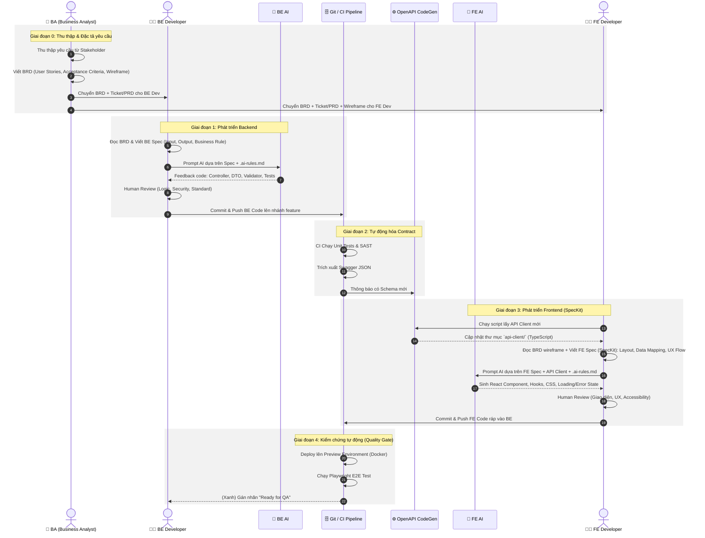

# Giao tiếp BE & FE trong kiến trúc AI-First Framework

Tài liệu này trực quan hóa cách **BA**, Backend Developer và Frontend Developer làm việc, phối hợp với các công cụ AI, và cách họ giao tiếp xuyên suốt thông qua **Contract-Driven API (OpenAPI/Swagger)** theo đặc tả tại `framework-specification.md`.

## 1. Flowchart: Tổng quan Không gian làm việc và Ranh giới Giao tiếp

Sơ đồ này thể hiện rõ ranh giới trách nhiệm. Điểm giao tiếp duy nhất giữa BE và FE là thông qua **Contract Boundary** (OpenAPI Schema). FE tuyệt đối không định nghĩa type bằng tay, mà phụ thuộc hoàn toàn vào Contract do BE tạo ra.

```mermaid
graph TD
    %% Định nghĩa các node
    subgraph "BA Zone (Nguồn gốc yêu cầu)"
        BA[💼 Business Analyst]
        BRD[📄 BRD \n Business Requirements]
        PRD[📝 Ticket / PRD]
        
        BA -->|1. Thu thập yêu cầu & Viết| BRD
        BRD -->|2. PO/Tech Lead tách task| PRD
    end

    subgraph "Backend (BE) Zone"
        BE_Dev[🧑‍💻 BE Developer]
        BE_AI[🤖 AI Assistant]
        Spec[📄 BE Spec \n (.md / SpecKit)]
        BE_Code[💻 BE Code \n .NET 10 Minimal API]
        
        PRD -->|Input cho BE| BE_Dev
        BE_Dev -->|3. Đọc BRD + Viết Spec| Spec
        BE_Dev -->|4. Đưa Spec + Prompt| BE_AI
        BE_AI -->|5. Sinh code chuẩn| BE_Code
        BE_Dev -.->|6. Review & Chịu trách nhiệm| BE_Code
    end

    subgraph "Contract Boundary (Tự động hóa 100%)"
        Swagger[📜 OpenAPI / Swagger JSON]
        AutoGen[⚙️ Tool CodeGen \n NSwag / RTK Query]
        TS_Client[📦 TypeScript API Client \n Type-safe]
        
        BE_Code ==>|CI tự động trích xuất| Swagger
        Swagger ==>|CI/FE tự động chạy script| AutoGen
        AutoGen ==>|Sinh ra| TS_Client
    end

    subgraph "Frontend (FE) Zone"
        FE_Dev[👨‍💻 FE Developer]
        FE_AI[🤖 AI Assistant]
        FE_Spec[📄 FE Feature Spec \n (.md / SpecKit)]
        FE_Code[🖥️ React Components \n TypeScript]
        
        PRD -->|Input cho FE| FE_Dev
        TS_Client ==>|Cung cấp Method & Types| FE_Code
        FE_Dev -->|7. Đọc BRD + Viết FE Spec: Layout, Data, UX| FE_Spec
        FE_Dev -->|8. Đưa FE Spec + API Client + Prompt| FE_AI
        FE_AI -->|9. Sinh code UI & Tích hợp data| FE_Code
        FE_Dev -.->|10. Review & Tinh chỉnh| FE_Code
    end

    %% Định dạng CSS cho biểu đồ
    classDef beZone fill:transparent,stroke:#118ab2,stroke-width:2px;
    classDef feZone fill:transparent,stroke:#d4a373,stroke-width:2px;
    classDef boundary fill:transparent,stroke:#2d6a4f,stroke-width:2px,stroke-dasharray: 5 5;
    classDef human fill:transparent,stroke:#fb8500,stroke-width:2px;
    classDef ai fill:transparent,stroke:#3a0ca3,stroke-width:2px;
    
    class BE_Dev,FE_Dev human;
    class BE_AI,FE_AI ai;
    class Swagger,AutoGen,TS_Client boundary;
```

## 2. Sequence Diagram: Luồng thời gian (Time-based Workflow)

Sơ đồ trình tự dưới đây diễn tả một vòng đời hoàn chỉnh khi phát triển một tính năng mới (Ví dụ: Thêm Màn hình Quản lý Đơn hàng). Ở đây thấy rõ Human (Con người) đóng vai trò người điều phối (Orchestrator) và kiểm tra định hướng, còn AI là người thực thi (Executor).



## 3. Bản tóm tắt vai trò

| Vai trò | Trách nhiệm chính trong kỷ nguyên AI-First | Không được làm |
|---------|---------------------------------------------|----------------|
| **💼 BA** | Viết BRD chuẩn xác: User Stories, Acceptance Criteria, Wireframe. Là **nguồn chân lý duy nhất** về yêu cầu nghiệp vụ. Duyệt thay đổi Spec nếu lệch khỏi BRD. | Không viết BRD mơ hồ, thiếu AC. Không đổi yêu cầu miệng mà không cập nhật BRD. |
| **🧑‍💻 BE Developer** | Đọc BRD → Viết BE Spec chuẩn xác. Đặt prompt để AI sinh code. Review bảo mật, logic phức tạp và tối ưu hiệu năng. | Không tự gõ code boilerplate. Không viết Spec không map về được BRD. |
| **🤖 BE AI** | Tuân thủ tuyệt đối `.ai-rules.md`. Sinh code DTO, validation, schema, tests, và logic cơ bản. | Không được tự ý đưa ra quyết định kiến trúc nằm ngoài Spec. |
| **⚙️ CI / CodeGen** | Đóng vai trò Sứ giả (Messenger). Đảm bảo FE luôn gọi BE với Typescript strict typing dựa vào OpenAPI. | Đứt gãy pipeline. Lọt lỗi build ra ngoài. |
| **👨‍💻 FE Developer** | Đọc BRD wireframe → **Viết FE Spec (SpecKit)** mô tả layout, data mapping, UX flow. Pull API client về. Prompt AI. Review giao diện. | **Không tự viết Fetch request bằng tay.** Không code UI mà chưa có FE Spec map về BRD. |
| **🤖 FE AI** | Đọc FE Spec → Sinh UI component, layout, CSS. Bọc API client vào Hooks, xử lý loading/error/empty state. Tuân thủ `.ai-rules.md`. | Sinh type "any". Gọi API bằng fetch thuần bỏ qua API Client. |
